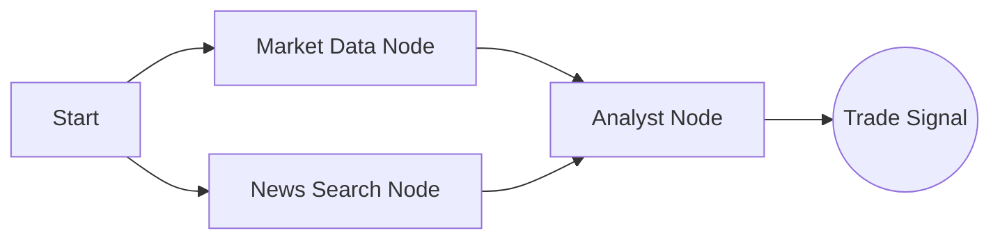

# Quantum Trader: AI Financial Analyst


**Quantum Trader** — это мультиагентная аналитическая платформа, имитирующая работу профессионального финансового аналитика. Приложение объединяет технический анализ (RSI, Price Action) с фундаментальным анализом новостей с помощью LLM, предоставляя торговые сигналы (BUY/SELL/HOLD) в реальном времени.

## Основные возможности

*   **Мультиагентная архитектура:**
    *   **Market Agent:** Загружает котировки и рассчитывает технические индикаторы (RSI).
    *   **News Agent:** Сканирует глобальные новости через DuckDuckGo Search.
    *   **Analyst Agent:** Синтезирует данные и принимает решение на базе Llama-3.
*   **Профессиональная визуализация:** Интерактивные графики (`Recharts`), индикаторы волатильности и цветовая кодировка сигналов.
*   **Высокая производительность:** Бэкенд на **FastAPI**, фронтенд на **Vite + React**, инференс через **Groq** (Llama-3.3-70b).
*   **Dockerized:** Полная контейнеризация (Nginx + Python API) для развертывания одной командой.

## Технологический стек

### Backend (API & AI)
*   **Framework:** FastAPI
*   **Orchestration:** LangGraph (Stateful Multi-Agent System)
*   **LLM:** Llama-3.3-70b-versatile (via Groq API)
*   **Data Sources:** Yahoo Finance (`yfinance`), DuckDuckGo Search
*   **Analysis:** Pandas, NumPy

### Frontend (UI)
*   **Framework:** React(Vite)
*   **Styling:** Tailwind CSS
*   **Charts:** Recharts
*   **Icons:** Lucide React

### DevOps
*   **Containerization:** Docker, Docker Compose
*   **Server:** Nginx (для раздачи статики React), Uvicorn (для Python)

## Архитектура Агентов



1.  Пользователь вводит тикер (например, `BTC-USD` или `NVDA`).
2.  Граф запускает параллельный сбор данных: цены и свежие новости.
3.  **Analyst Node** получает JSON с данными и генерирует стратегию:
    *   Анализирует RSI (перекупленность/перепроданность).
    *   Оценивает сентимент новостей.
    *   Выдает вердикт `BUY`, `SELL` или `HOLD` с объяснением причин.

## Установка и запуск

### Предварительные требования
*   Docker & Docker Compose
*   API Key от [Groq](https://console.groq.com) (Бесплатный)

### Способ 1: Запуск через Docker

1.  **Клонируйте репозиторий:**
    ```bash
    git clone https://github.com/egocucumber/trader.git
    cd trader
    ```

2.  **Настройте ключи:**
    Создайте файл `backend/.env` и добавьте ваш ключ:
    ```env
    GROQ_API_KEY=gsk_....
    ```

3.  **Запустите контейнеры:**
    ```bash
    docker-compose up --build
    ```

4.  **Готово!**
    *   Frontend: [http://localhost:3000](http://localhost:3000)
    *   Backend Docs: [http://localhost:8000/docs](http://localhost:8000/docs)

---

### Способ 2: Локальный запуск (Без Docker)

<details>
<summary>Развернуть инструкцию</summary>

#### Backend
```bash
cd backend
python -m venv .venv
source .venv/bin/activate  # Windows: .venv\Scripts\activate
pip install -r requirements.txt
python -m app.main
```

#### Frontend
```bash
cd frontend
npm install
npm run dev
```
</details>
